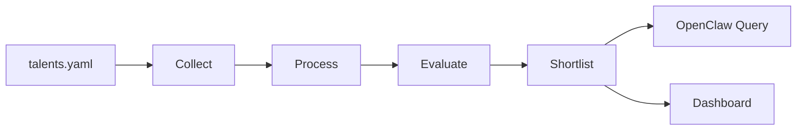

# Talent Scout

[](https://github.com/presence-io/talent-scout/actions/workflows/publish.yml)
[](https://www.npmjs.com/package/@talent-scout/skills)
[](https://nodejs.org/)
[](https://pnpm.io/)
[](./LICENSE)

Talent Scout 用来持续发现和评估“AI Coding 时代值得关注的中文开发者”。

它把一次完整的人才发现工作拆成四件事：收集线索、整理候选人、做 AI 辅助评估、把结果展示给招聘方或研究者。仓库根目录只讲你如何开始使用这个系统；具体实现、算法和开发细节请看各子项目 README。

## 这个项目适合谁

- 想在 GitHub 上持续挖掘优秀中文开发者的招聘团队
- 想基于 OpenClaw 运营长期人才雷达的个人或小团队
- 想研究 AI 工具采用情况、社区影响力和代码活跃度的维护者

## 你能用它做什么

- 通过 GitHub 线索、社区榜单和 AI 工具使用痕迹建立候选池
- 用统一的 `talents.yaml` 管理目标画像、阈值、数据源和定时任务
- 通过 OpenClaw agent 做灰区身份判断和深度评估
- 在本地 Dashboard 中查看 shortlist、统计分布和人工标注

## 工作流概览



## 快速开始

### 1. 准备环境

项目依赖以下工具：

- Node.js 22+
- pnpm 10+
- GitHub CLI `gh`
- OpenClaw CLI `openclaw`

安装依赖：

```bash
pnpm install
```

### 2. 在 OpenClaw 中安装 skill

这个仓库对 OpenClaw/ClawHub 暴露的统一技能入口是 `talent-scout`。

如果你已经从 ClawHub 发布了该 skill，可以在 OpenClaw 工作区里执行：

```bash
openclaw skills search "talent scout"
openclaw skills install talent-scout
```

安装完成后，开启一个新的 OpenClaw session，让工作区里的 skill 被重新加载。

如果你当前是在本仓库源码里试用，还没有发布到 ClawHub，可以直接使用项目自带命令：

```bash
pnpm --filter @talent-scout/skills run skill pipeline
```

### 3. 编写 `talents.yaml`

`talents.yaml` 是整个系统的唯一配置入口。你不需要一次写满所有字段，先把目标画像、OpenClaw agent 和最关心的线索源配置好就够了。

一个适合起步的示例：

```yaml
code_signals:
  - filename: AGENTS.md
    path: /AGENTS.md
    weight: 2
    label: code:agents-md

ranking_sources:
  - name: chinese-independent-developer
    type: github-readme
    repo: 1c7/chinese-independent-developer
    signal_type: seed:list
    weight: 5

target_profile:
  preferred_cities:
    - Shanghai
    - Hangzhou
  preferred_languages:
    - TypeScript
    - Python
    - Go

openclaw:
  agents:
    identity:
      name: talent-identity
      workspace: ./packages/data-processor
      timeout: 120
    evaluator:
      name: talent-evaluator
      workspace: ./packages/ai-evaluator
      timeout: 180
  batch_size: 10
  cron:
    - name: talent-pipeline
      schedule: "0 1 * * 0"
      command: "cd {{project_dir}} && pnpm --filter @talent-scout/skills run skill pipeline"
      description: "Weekly full pipeline"
```

完整字段定义请参考 [docs/07-data-model.md](./docs/07-data-model.md) 和各子项目 README。

### 4. 跑一次最典型的完整流程

最常见的用法是每周跑一次完整 pipeline，然后在 OpenClaw 和 Dashboard 中查看 shortlist。

```bash
pnpm pipeline
```

这条命令会按顺序完成：

1. 收集候选线索
2. 合并、去重和身份识别
3. 调用 OpenClaw 做 AI 辅助评估
4. 更新 `workspace-data/output/` 下的最新结果

### 5. 在 OpenClaw 中触发常见任务

安装完 skill 并开启新 session 后，可以直接用自然语言触发最典型的功能。下面是三个适合直接复制的例子。

场景一：让 agent 跑一次完整流程

```text
请使用 talent-scout skill 按当前工作区的 talents.yaml 跑一次完整 pipeline。
```

场景二：查看当前 shortlist

```text
请读取当前 shortlist，列出最值得联系的前 10 位候选人，并说明理由。
```

场景三：同步定时任务到 OpenClaw

```text
请把 talents.yaml 中定义的 cron 同步到 OpenClaw，并告诉我有哪些任务被创建或更新了。
```

## 一个容易理解的使用案例

假设你每周都要更新一份“值得主动联系的中文 AI 工程师名单”，可以按下面操作：

1. 修改 `talents.yaml`，把目标城市和偏好的技术栈改成你的招聘方向。
2. 运行 `pnpm pipeline`，生成最新候选池。
3. 在 OpenClaw 中让 `talent-scout` 总结 shortlist，先用自然语言筛出高优先级候选人。
4. 打开 Dashboard，查看这些人的证据链、人工标注和运行统计。
5. 如果你准备长期运行，再把 cron 同步到 OpenClaw，让系统自动每周刷新。

## 去哪里看细节

- [packages/shared/README.md](./packages/shared/README.md): 共享类型、配置加载、GitHub/OpenClaw 封装
- [packages/data-collector/README.md](./packages/data-collector/README.md): 多源线索采集
- [packages/data-processor/README.md](./packages/data-processor/README.md): 去重、身份识别、规则评分
- [packages/ai-evaluator/README.md](./packages/ai-evaluator/README.md): OpenClaw AI 评估与 shortlist 生成
- [packages/dashboard/README.md](./packages/dashboard/README.md): 本地 Web 界面和 `workspace-data` 使用方式
- [packages/skills/README.md](./packages/skills/README.md): ClawHub/OpenClaw skill 的发布、测试与命令面

## 许可证

本项目使用 MIT 协议，见 [LICENSE](./LICENSE)。
