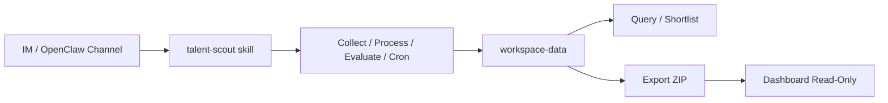

# Talent Scout

[](https://github.com/presence-io/talent-scout/actions/workflows/publish.yml)
[](https://www.npmjs.com/package/@talent-scout/skills)
[](https://nodejs.org/)
[](https://pnpm.io/)
[](./LICENSE)

Talent Scout 用来持续发现和评估“AI Coding 时代值得关注的中文开发者”。

它的核心体验不是“本地跑几个脚本”，而是把一组稳定的 skill 命令暴露给 OpenClaw。只要你的 OpenClaw 已经接入某个 IM/channel，用户就可以直接发自然语言消息，请它跑 pipeline、查看 shortlist、启停 cron、请求修改配置，或者导出当前工作区给 Dashboard 使用。

仓库根目录只讲你如何开始使用和部署这套体验；更细的实现、算法和开发细节请看各子项目 README。

## 这个项目适合谁

- 想在 GitHub 上持续挖掘优秀中文开发者的招聘团队
- 想基于 OpenClaw 运营长期人才雷达的个人或小团队
- 想研究 AI 工具采用情况、社区影响力和代码活跃度的维护者

## 你能用它做什么

- 通过 GitHub 线索、社区榜单和 AI 工具使用痕迹建立候选池
- 让 OpenClaw 用自然语言驱动 `collect / process / evaluate / pipeline / cron / config request` 等操作
- 通过 OpenClaw agent 做灰区身份判断和深度评估
- 把当前 `workspace-data/` 打包成 zip，交给其他 OpenClaw skill 发到 IM，或本地用 Dashboard 只读查看

## 工作流概览



## 快速开始

### 1. 准备环境

项目依赖以下工具：

- Node.js 22+
- pnpm 10+
- GitHub CLI `gh`
- OpenClaw CLI `openclaw`

如果你要使用 `config request` 这类“通过 IM/channel 让 AI 修改配置”的能力，还需要在 OpenClaw 里先配置一个可用的消息 channel/account。

安装依赖：

```bash
pnpm install
```

### 2. 在 OpenClaw 中安装 skill

这个仓库对 OpenClaw/ClawHub 暴露的统一技能入口是 `talent-scout`。

如果你已经从 ClawHub 发布了该 skill，可以在 OpenClaw 工作区里执行：

```bash
openclaw skills search "talent scout"
openclaw skills install talent-scout
```

安装完成后，开启一个新的 OpenClaw session，让工作区里的 skill 被重新加载。

如果你当前是在本仓库源码里试用，还没有发布到 ClawHub，可以直接使用项目自带命令：

```bash
pnpm --filter @talent-scout/skills run skill pipeline
```

### 3. 理解配置文件的位置

当前真正会被 skills 和 dashboard 读取的，是 `workspace-data/talents.yaml`。

它的生命周期是这样的：

1. `@talent-scout/skills` 包内自带一个默认模板。
2. 第一次需要写工作区时，skills 会自动把模板复制到 `workspace-data/talents.yaml`。
3. 后续的 collect / process / evaluate / pipeline / cron / config request 都读取这份工作区配置。

仓库根目录的 `talents.yaml` 更适合作为默认样例和开发参考，而不是长期运行时唯一真源。

一个适合起步的示例：

```yaml
code_signals:
  - filename: AGENTS.md
    path: /AGENTS.md
    weight: 2
    label: code:agents-md

ranking_sources:
  - name: chinese-independent-developer
    type: github-readme
    repo: 1c7/chinese-independent-developer
    signal_type: seed:list
    weight: 5

target_profile:
  preferred_cities:
    - name: Shanghai
      bonus: 1
    - name: Hangzhou
      bonus: 1
  preferred_languages:
    - TypeScript
    - Python
    - Go

openclaw:
  agents:
    identity:
      name: talent-identity
      workspace: ./packages/data-processor
      timeout: 120
    evaluator:
      name: talent-evaluator
      workspace: ./packages/ai-evaluator
      timeout: 180
  batch_size: 10
  delivery:
    channel: telegram
    target: '@your-openclaw-channel'
  cron:
    - name: talent-pipeline
      schedule: "0 1 * * 0"
      command: "cd {{project_dir}} && pnpm --filter @talent-scout/skills run skill pipeline"
      description: "Weekly full pipeline"
```

如果你不想手工改 YAML，也可以稍后通过 `config request` 让 OpenClaw 代你修改这份工作区配置。

注意：`config request` 依赖 `openclaw message send`。即使使用 `--dry-run`，OpenClaw 也会先检查对应 channel 是否在当前环境可用。

完整字段定义请参考 [docs/07-data-model.md](./docs/07-data-model.md) 和各子项目 README。

### 4. 跑一次最典型的完整流程

最常见的用法是每周跑一次完整 pipeline，然后在 OpenClaw 和 Dashboard 中查看 shortlist。

```bash
pnpm pipeline
```

这条命令会按顺序完成：

1. 收集候选线索
2. 合并、去重和身份识别
3. 调用 OpenClaw 做 AI 辅助评估
4. 更新 `workspace-data/output/` 下的最新结果

### 5. 在 OpenClaw 中触发常见任务

安装完 skill 并开启新 session 后，可以直接用自然语言触发已经实现好的命令面。下面这些例子都对应当前 skills 中真实存在的功能。

场景一：让 agent 跑一次完整流程

```text
请使用 talent-scout skill 按当前工作区的 workspace-data/talents.yaml 跑一次完整 pipeline。
```

场景二：查看当前 shortlist

```text
请读取当前 shortlist，列出最值得联系的前 10 位候选人，并说明理由。
```

场景三：请求修改工作区配置

```text
请使用 talent-scout skill 请求 AI 修改 workspace-data/talents.yaml，把 openclaw.batch_size 改成 20。
```

场景四：同步并启停定时任务

```text
请把 workspace-data/talents.yaml 中定义的 cron 同步到 OpenClaw，并告诉我有哪些任务被创建或更新了。
```

```text
请使用 talent-scout skill 暂停 talent-pipeline 这个 cron。
```

```text
请使用 talent-scout skill 恢复 talent-pipeline 这个 cron。
```

场景五：导出给 Dashboard 使用的 zip

```text
请使用 talent-scout skill 导出当前 workspace-data，并把 zip 文件的本地绝对路径告诉我。
```

`talent-scout` skill 本身只负责生成 zip 并返回路径，不负责把文件发到 Telegram/Slack/Discord。如果你希望把这个 zip 发给用户，需要再调用另一个专门负责文件投递的 OpenClaw skill。

同样地，`config request` 也要求目标 channel 在当前 OpenClaw 环境里是可用的；如果 channel 没有配置好，命令会在发送阶段失败。

用户拿到 zip 之后，可以本地启动 Dashboard：

```bash
npx @talent-scout/dashboard --workspace /absolute/path/to/workspace-data.zip
```

此时 Dashboard 会自动进入只读模式。

## 一个容易理解的使用案例

假设你每周都要更新一份“值得主动联系的中文 AI 工程师名单”，可以按下面操作：

1. 先让 skills 初始化 `workspace-data/talents.yaml`，或者手工复制模板并改成你的招聘方向。
2. 运行 `pnpm pipeline`，生成最新候选池。
3. 在 OpenClaw 中让 `talent-scout` 总结 shortlist，先用自然语言筛出高优先级候选人。
4. 如果需要改配置，不直接手改脚本，而是让 `talent-scout` 发起一次 `config request`。
5. 如果你准备长期运行，再把 cron 同步到 OpenClaw，并按需要启停具体任务。
6. 如果你想把结果发给别人看，就先导出 zip，再交给其他文件投递 skill，或本地用 Dashboard 打开。

## 去哪里看细节

- [@talent-scout/shared](./packages/shared/README.md): 共享类型、配置加载、GitHub/OpenClaw 封装
- [@talent-scout/data-collector](./packages/data-collector/README.md): 多源线索采集
- [@talent-scout/data-processor](./packages/data-processor/README.md): 去重、身份识别、规则评分
- [@talent-scout/ai-evaluator](./packages/ai-evaluator/README.md): OpenClaw AI 评估与 shortlist 生成
- [@talent-scout/dashboard](./packages/dashboard/README.md): 本地 Web 界面和 `workspace-data` 使用方式
- [@talent-scout/skills](./packages/skills/README.md): ClawHub/OpenClaw skill 的发布、测试与命令面

## 许可证

本项目使用 MIT 协议，见 [LICENSE](./LICENSE)。
