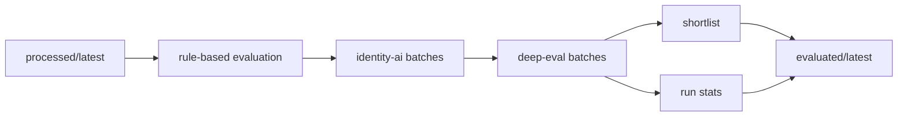

# @talent-scout/ai-evaluator

[](https://github.com/huandu/talent-scout/actions/workflows/publish.yml)
[](https://www.npmjs.com/package/@talent-scout/ai-evaluator)
[](https://nodejs.org/)
[](../../LICENSE)

`@talent-scout/ai-evaluator` 在规则层之上增加 OpenClaw 驱动的 AI 判断。它解决两个问题：

- 规则层无法明确判断的灰区身份
- 对 top 候选人做更深的技术与 AI 采用深度评估

## 开发前提

- Node.js 22+
- pnpm 10+
- `openclaw` 已安装
- `talents.yaml` 中已配置 `openclaw.agents.identity` 和 `openclaw.agents.evaluator`

在仓库根目录安装依赖：

```bash
pnpm install
```

## 常用命令

```bash
pnpm --filter @talent-scout/ai-evaluator run evaluate
pnpm --filter @talent-scout/ai-evaluator run build
```

`evaluate` 读取 `workspace-data/output/processed/latest/`，产出 `workspace-data/output/evaluated/<timestamp>/`，并刷新 `latest`。

## 核心模块

- `src/pipeline.ts`: 评估总流程
- `src/identity-ai.ts`: 灰区身份的批量 AI 推断
- `src/deep-eval.ts`: top 候选人的批量深度评估
- `src/shortlist.ts`: shortlist 生成
- `src/skills.ts`: 运行统计聚合
- `src/query.ts`: shortlist、evaluation、stats 查询接口

## 设计思想

### 1. AI 只接管“规则层难以稳定处理”的部分

这个包不是把所有评分都交给 LLM。相反，它只在两个高价值场景使用 AI：

- 规则层无法稳定判断的身份灰区
- 进入重点观察名单后的深度评估

这样可以控制成本，也能保留大部分排序逻辑的可解释性。

### 2. 批处理和 checkpoint 比“单次更聪明”更重要

OpenClaw 调用最贵的不是单次 prompt 设计，而是批量执行时的可靠性。这里的核心实现不是 fancy prompt，而是：

- 批次切分
- 每批落 checkpoint
- 失败后恢复未完成批次

这决定了项目能不能稳定处理上百名候选人。

### 3. 最终排序是多轴组合，不是单一分数幻觉

这里保留 `skill_score`、`ai_depth_score`、`reachability_score`、`fit_score` 四个轴，再通过权重组合成最终分数。这样招聘者可以看“为什么高”，而不是只看一个无法拆解的总分。

## 评估流程



## 实现边界

- 默认只对高优先级候选人做深度评估，避免无限扩张 AI 成本
- 活跃度惩罚仍然保留在规则层，防止“历史光环”压过当前状态
- 最终结果通过查询接口暴露给 Dashboard 和 skills，而不是让消费方直接读底层文件

## 调整这个包时需要注意

- 改 batch 大小前，先验证 OpenClaw 超时和返回 JSON 稳定性
- 改推荐动作阈值时，要同时看 shortlist 数量和质量是否失衡
- 改查询接口时，要同步考虑 Dashboard 和 `@talent-scout/skills` 两个消费者

## 相关文档

- [05-evaluation.md](../../docs/05-evaluation.md)
- [06-openclaw.md](../../docs/06-openclaw.md)
