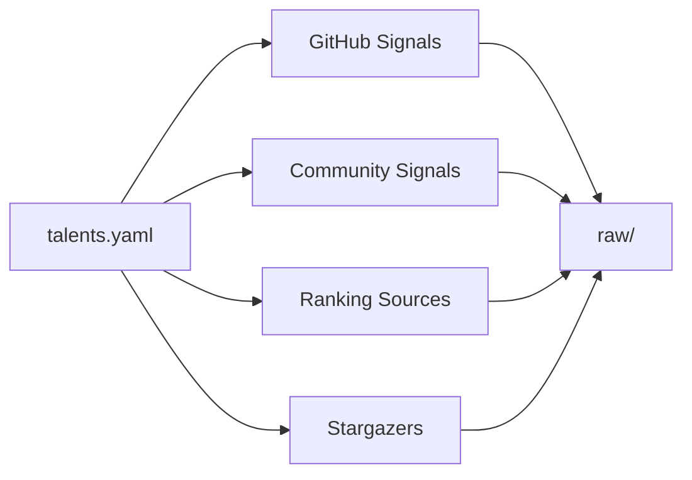

# @talent-scout/data-collector

[](https://github.com/huandu/talent-scout/actions/workflows/publish.yml)
[](https://www.npmjs.com/package/@talent-scout/data-collector)
[](https://nodejs.org/)
[](../../LICENSE)

`@talent-scout/data-collector` 负责建立候选池。它从 GitHub、社区仓库、榜单页面和 AI 工具生态里收集信号，并把这些原始线索写入 `workspace-data/output/raw/<timestamp>/`。

## 开发前提

- Node.js 22+
- pnpm 10+
- `gh` 已安装并登录
- Playwright 依赖可正常运行

统一在仓库根目录安装依赖：

```bash
pnpm install
```

## 常用命令

```bash
pnpm --filter @talent-scout/data-collector run collect
pnpm --filter @talent-scout/data-collector run build
```

命令应从仓库根目录发起。包内部会利用 `INIT_CWD` 和共享工作区解析逻辑，把输出写到根目录的 `workspace-data/`。

## 采集范围

- 代码仓库中的 AI 工具使用信号，例如 `AGENTS.md`、`copilot-instructions.md`、`.cursorrules`
- commit 历史中的协作和 AI 使用痕迹
- `claude-code`、`mcp-server`、`copilot` 等 topic 相关仓库
- 社区仓库的 contributor、stargazer、fork 网络
- 排行榜和种子列表

## 关键模块

- `src/index.ts`: 采集入口，负责恢复已有结果或启动新的 run
- `src/github-signals.ts`: GitHub 搜索线索
- `src/community.ts`: 社区仓库信号
- `src/rankings.ts`: 排行榜抓取
- `src/stargazers.ts`: AI 工具相关仓库的 stargazer 采集
- `src/follower-graph.ts`: 关注关系扩展的占位实现
- `src/query.ts`: 读取已落盘的 raw 数据

## 设计思想

### 1. 采集要覆盖“显式信号”和“弱信号”

如果只看 AI 工具仓库的 star，很容易把“好奇用户”和“真实高质量开发者”混在一起。所以这个包同时采集：

- 显式信号：配置文件、commit 文本、社区贡献
- 弱信号：stargazer、topic 相关仓库、榜单曝光

处理阶段再决定这些信号如何加权。

### 2. 采集过程必须可恢复

每个采集器都遵循“先检查本地输出，缺失时才执行”的模式。这样一旦排行榜抓取或 GitHub 搜索在中途失败，你不需要从头重新跑整轮采集。

### 3. 工具生态要保持平权

配置里的默认设计把 Claude、Copilot、Cursor、Cline、Windsurf 等工具视为同级信号来源，而不是只偏向某一个生态。这避免候选池被单一社区习惯扭曲。

## 实现流程



## 当前边界

- GitHub Search API 仍然受分页上限约束
- 排行榜抓取依赖页面结构，源站改版时需要修复解析器
- `follower-graph.ts` 目前还不是完整生产实现

## 相关文档

- [03-data-sources.md](../../docs/03-data-sources.md)
- [02-architecture.md](../../docs/02-architecture.md)
