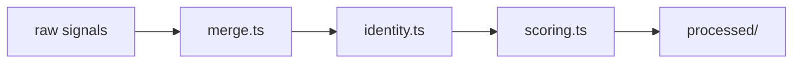

# @talent-scout/data-processor

[](https://github.com/presence-io/talent-scout/actions/workflows/publish.yml)
[](https://www.npmjs.com/package/@talent-scout/data-processor)
[](https://nodejs.org/)
[](../../LICENSE)

`@talent-scout/data-processor` 把原始线索变成可评估的候选人。它负责合并、去重、身份识别和规则层评分，是从“线索池”走向“候选池”的关键分水岭。

## 开发前提

- Node.js 22+
- pnpm 10+
- `gh` 已安装并登录

在仓库根目录安装依赖：

```bash
pnpm install
```

## 常用命令

```bash
pnpm --filter @talent-scout/data-processor run process
pnpm --filter @talent-scout/data-processor run validate:identity
pnpm --filter @talent-scout/data-processor run build
```

`process` 会读取最新的 raw 输出，并写入 `workspace-data/output/processed/<timestamp>/`。

## 核心模块

- `src/cli.ts`: 处理入口
- `src/merge.ts`: 候选人合并与信号去重
- `src/identity.ts`: 中文开发者身份识别
- `src/scoring.ts`: 规则层评分
- `src/query.ts`: 读取处理后的数据
- `src/validate-identity.ts`: 身份识别调试脚本

## 设计思想

### 1. 中文身份是硬过滤，不是加分项

这个项目的目标用户群本来就是“值得关注的中文开发者”。因此身份判断应该在评估前完成，而不是把“是否中文开发者”混进最终评分里，否则会把目标画像和能力判断混在一起。

### 2. 用 noisy-or 组合弱信号

身份识别不是单条规则命中就结束。这里采用 noisy-or 思路，把位置、邮箱域名、中文 bio、中文 commit、拼音姓名、UTC+8 活跃模式等弱信号累积成整体置信度：

$$
P(中国) = 1 - \prod_i (1 - p_i)
$$

这样做的好处是：

- 强信号可以直接拉高置信度
- 多个中弱信号可以自然叠加
- 没有信号时不会虚构高分

### 3. 规则评分只负责“稳定、可解释”的部分

`scoring.ts` 只做那些能从 profile 和 repo 特征中稳定算出的维度，例如：

- stars、followers、语言多样性、最近活跃月数
- fork 比例
- 热点追逐和批量 fork 这类反模式

灰区身份和深度技术判断留给 `@talent-scout/ai-evaluator`。

## 实现流



## 算法取舍

- 合并阶段按信号来源去重，避免同一事件在多个采集器里重复加分
- 身份识别保留灰区区间，交给 AI 再判断，而不是强行二分类
- 评分优先保证解释性，避免在规则层引入难以维护的黑盒模型

## 调试建议

- 身份误判优先跑 `validate:identity` 看规则层命中情况
- 如果某类候选人被系统性低估，先检查 merge 和特征提取，再讨论阈值
- 修改评分公式时，要同时关注 `ai-evaluator` 的最终排序是否发生不合理漂移

## 相关文档

- [04-identity.md](../../docs/04-identity.md)
- [05-evaluation.md](../../docs/05-evaluation.md)
- [07-data-model.md](../../docs/07-data-model.md)
