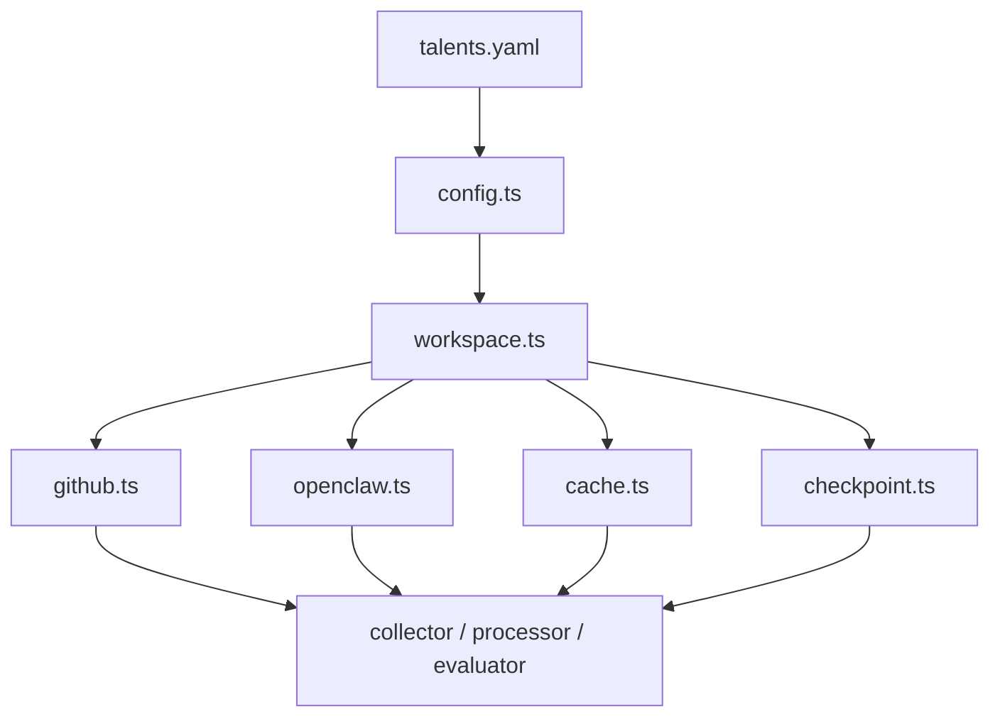

# @talent-scout/shared

[](https://github.com/huandu/talent-scout/actions/workflows/publish.yml)
[](https://www.npmjs.com/package/@talent-scout/shared)
[](https://nodejs.org/)
[](../../LICENSE)

`@talent-scout/shared` 是整个 monorepo 的基础设施层。它不做业务决策，负责把配置、工作区路径、缓存、GitHub CLI、OpenClaw CLI 和共享类型统一起来，让其他包专注在收集、处理、评估和展示上。

## 开发前提

- Node.js 22+
- pnpm 10+
- `gh` 已安装并完成认证
- `openclaw` 已安装，用于 cron 同步和 agent 调用

在仓库根目录安装依赖：

```bash
pnpm install
```

## 常用命令

```bash
pnpm --filter @talent-scout/shared run build
pnpm --filter @talent-scout/shared run cron:sync
```

`cron:sync` 会读取仓库根目录的 `talents.yaml`，把其中定义的 `openclaw.cron` 同步到本地 OpenClaw。

## 它解决了哪些问题

- 用一个 Zod 校验过的配置入口替代每个包各自读取 YAML
- 用统一的工作区路径解析，保证所有包都围绕 `workspace-data/` 工作
- 用文件缓存和 checkpoint 机制控制高成本 CLI 调用
- 用共享类型把候选人、信号、评估结果和统计结构稳定下来

## 目录职责

- `src/config.ts`: 读取并校验 `talents.yaml`
- `src/workspace.ts`: 解析 `workspace-data/`、`output/`、`user-data/`、`cache/`、`skill-patches/`
- `src/github.ts`: 封装 `gh` CLI 的分页、缓存和结果整理
- `src/openclaw.ts`: 统一 `openclaw agent` 和 `openclaw cron` 的参数编排
- `src/cache.ts`: 文件缓存
- `src/checkpoint.ts`: 可恢复的批处理检查点
- `src/ignore-list.ts`: 跨包共享的忽略名单读写

## 设计思路

### 1. 配置必须是唯一事实来源

所有业务包都通过 `loadConfig()` 获取配置，而不是在包内复制默认值。这样做有两个直接好处：

- 调阈值时不会出现多处不一致
- `skills`、`dashboard` 和业务包能共享同一份运行语义

### 2. CLI 封装要比 SDK 更稳定

这个仓库刻意依赖 `gh` 和 `openclaw` CLI，而不是直接引入 GitHub SDK 或 LLM SDK。原因很简单：模型路由、权限和工作区状态都已经由 CLI 管理，`shared` 只需要把参数约束收口即可。

### 3. 工作区状态要与源码分离

运行时数据全部写到 `workspace-data/`。这让你可以反复重跑 pipeline，而不会污染源代码目录，也方便 Dashboard 和 skills 在不改动业务逻辑的前提下消费同一份结果。

## 实现流



## 修改这个包时的判断标准

- 如果改动会影响多个包的运行语义，优先放在这里统一处理
- 如果某段逻辑只属于一个业务域，不要上移到 `shared`
- 如果新增字段进入 `talents.yaml`，要同步补充校验与默认值策略

## 相关文档

- [02-architecture.md](../../docs/02-architecture.md)
- [06-openclaw.md](../../docs/06-openclaw.md)
- [07-data-model.md](../../docs/07-data-model.md)
